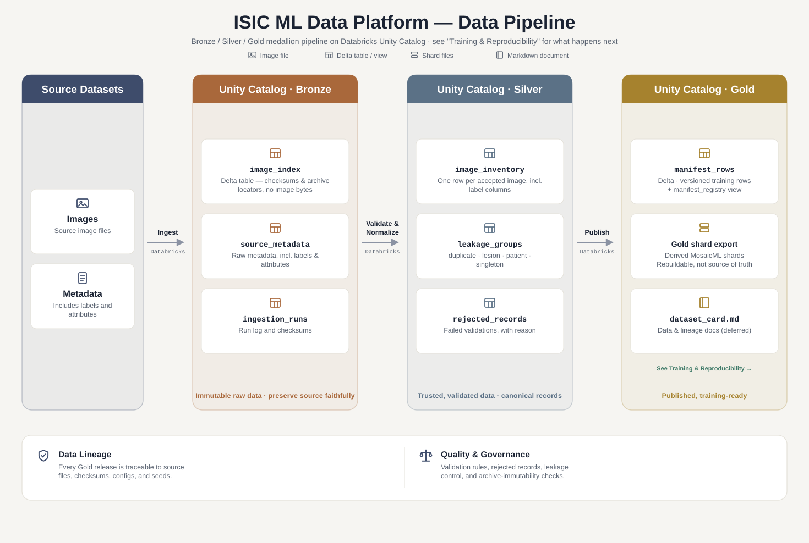
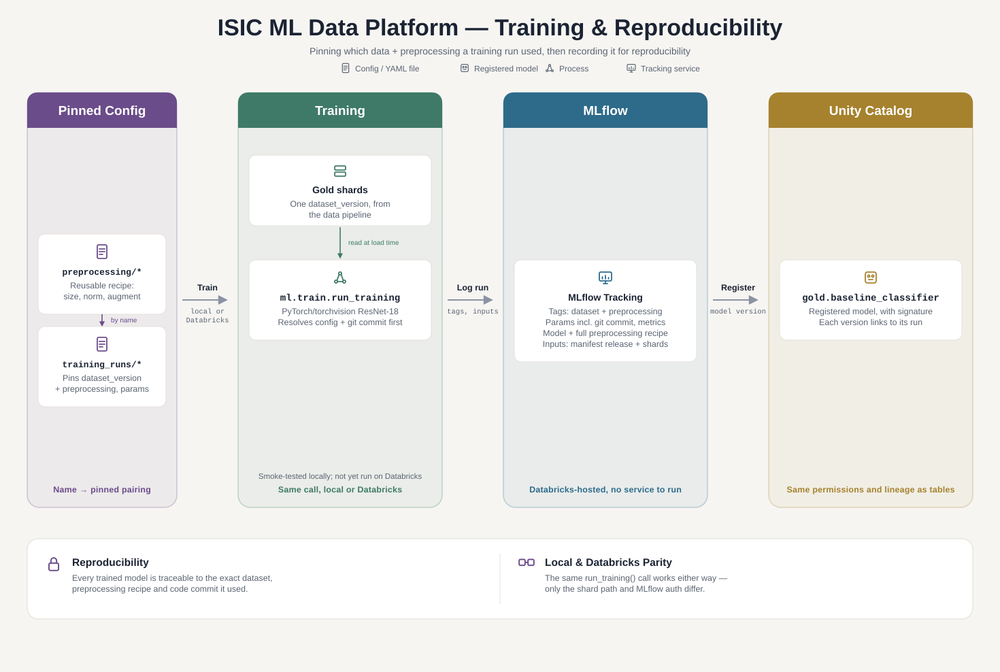

# Architecture

A Bronze / Silver / Gold medallion layout on Databricks Unity Catalog, handling ingestion, validation, transformation, and model training.

## System overview



Image bytes live solely in the landing-volume source archives — never in a table, never extracted as individual Volume objects (`docs/decisions/006-stream-archives-no-blob-storage.md`). Bronze/Silver hold only checksums and archive locators; any layer needing actual bytes (Silver validation, Gold shard export) streams them from the archive on demand. Everything else in Silver/Gold is tabular — outputs, manifests, and quality records referencing the archives via an archive-resolvable `bronze_uri`.

## Storage layout

Two Unity Catalog volumes are used for file storage:

```text
/Volumes/derm_showcase_project/bronze/landing/
  archives/
    isic_2019/
    milk10k/
/Volumes/derm_showcase_project/bronze/files/
  isic_2019/
    metadata/
  milk10k/
    metadata/
  gold/sample-v1/
    metadata/        (per-dataset source metadata CSVs for the release)
    shards/
      train/
      validation/
      test/
```

Silver (`silver.image_inventory`, `silver.leakage_groups`, `silver.rejected_records`) is table-only — no Volume folders, so it doesn't appear above. `gold/<dataset_version>/shards/` is a derived, fully rebuildable cache written by `notebooks/31_export_gold_shards.ipynb` (MosaicML shards, one directory per split); how long an export is kept around is still an open question (`docs/decisions/009-gold-shard-retention-undecided.md`).

### Layer responsibilities

| Layer | Responsibility | Typical contents |
|---|---|---|
| Bronze | Preserve the source faithfully | Image index (checksums, archive locators — no image bytes), raw metadata, raw labels, ingestion logs |
| Silver | Produce a trustworthy canonical view | Image inventory, normalized labels, validation results, leakage-control groups, rejected rows |
| Gold | Publish training-ready data products | Versioned manifest, dataset card (deferred), derived per-release MosaicML shard export |

## Databricks structure

A dedicated catalog holds the project's tables; file storage lives in volumes:

```text
Catalog: derm_showcase_project
  Schema: bronze
    Tables:
      ingestion_runs
      <dataset>_image_index
      <dataset>_source_metadata
      # one pair per onboarded dataset, e.g. isic_2019_*, milk10k_*
    Volumes:
      landing
      files
  Schema: silver
    Tables:
      image_inventory
      leakage_groups
      rejected_records
  Schema: gold
    Tables:
      manifest_rows
    Views:
      manifest_registry
    Models:
      baseline_classifier   (Unity Catalog model registered by training)
```

The catalog holds logical tabular assets only — source archives stay in the landing Volume as the sole permanent store of image bytes, never written to a table or materialized as an individual Volume object (`docs/decisions/006-stream-archives-no-blob-storage.md`). Raw metadata, manifests, and the derived Gold shard export live in Unity Catalog volume paths. In short: the Volume layout above describes where files live; this catalog structure describes where tables live.

## Pipeline stages

Each stage is a numbered notebook, run by hand in order today. Scheduling them as Databricks Jobs is future work.

1. **Bronze ingestion** — stage each archive locally, index checksum/archive locator per image (no bytes retained), ingest metadata.
2. **Silver validation** — stream candidate images from their source archives, validate, normalize metadata, assign leakage-control groups.
3. **Gold publishing** — generate a deterministic classification manifest (a dataset card is deferred).
4. **Gold shard export** — stream a published manifest's images into a derived, per-release MosaicML shard export.
5. **Training** — consume the shard export (locally, or on Databricks serverless reading the Volume), track metrics in MLflow.

## Training and reproducibility



`ml.train.run_training` reads a `config/gold/training_runs/<name>.yaml`, which pins exactly one
`dataset_version` (which images) to exactly one `preprocessing_version` (`config/preprocessing/<name>.yaml`
— resize/normalize/augment, applied only at load time). The same call trains locally or on
Databricks — only the shard path and MLflow auth resolution differ. Every run logs to MLflow
(hyperparameters, metrics, the git commit, the full preprocessing recipe, `dataset_version`/
`preprocessing_version`/`training_run_name` as tags, and the Gold manifest release and shard files
it read as dataset inputs). The model is logged with a signature and registered in Unity Catalog.
There's no separate registry table. See
`docs/decisions/010-pin-data-and-preprocessing-per-training-run.md` and
`docs/decisions/014-run-lineage-in-mlflow-and-unity-catalog.md` for the full reasoning.

## Reproducibility rules

- Source image bytes are immutable in the landing-volume archives, the sole permanent store at any layer — checked, not assumed: Silver validation and Gold shard export both re-verify each streamed image's checksum against what Bronze originally recorded, failing loudly on any mismatch (`docs/decisions/008-immutable-source-archives-checksum-verified.md`).
- Silver and Gold reference the source archive (via `bronze_uri`) rather than duplicating bytes into a table. The one scoped exception, the Gold shard export, is a derived, fully rebuildable cache, never a second source of truth (`docs/decisions/006-stream-archives-no-blob-storage.md`) — how long it's kept around is still undecided (`docs/decisions/009-gold-shard-retention-undecided.md`).
- Preprocessing is versioned config (`config/preprocessing/<name>.yaml`), applied at training/inference runtime only — never baked into stored bytes (`docs/decisions/010-pin-data-and-preprocessing-per-training-run.md`).
- Every Gold release is traceable to its source files, source-image checksums, config, seeds and the Git commit of the code that wrote it. Training runs record their commit too, and neither will run without one ([ADR 013](decisions/013-record-git-commit-on-releases-and-runs.md)).
- Every trained model is traceable to the exact Gold release, preprocessing recipe and code commit it used, through its MLflow run and its Unity Catalog model version.
- Fixture tests use only small local files, never the full ISIC dataset.
