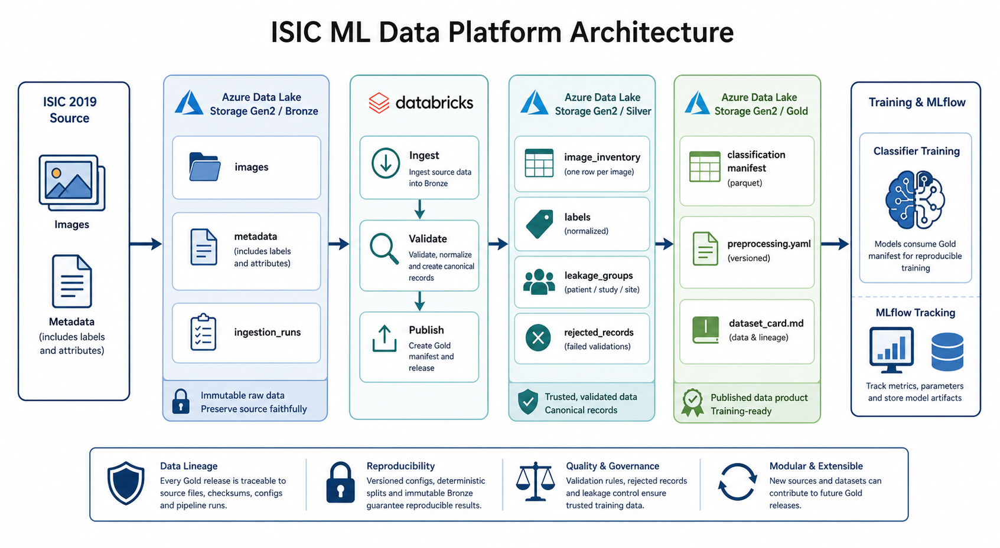

# Architecture

This project uses a Bronze / Silver / Gold medallion layout on Databricks Unity Catalog, with Databricks handling ingestion, validation, transformation, and model training.

## System overview



The design keeps the original image bytes in Bronze and uses Silver and Gold primarily for tabular outputs, manifests, and quality records that reference the Bronze assets.

## Storage layout

Two Unity Catalog volumes are used for file storage:

```text
/Volumes/derm_showcase_project/bronze/landing/
  archives/
    isic_2019/
/Volumes/derm_showcase_project/bronze/files/
  isic_2019/
    metadata/
  silver/isic_2019/
    image_inventory/
    labels/
    leakage_groups/
    rejected_records/
  gold/classification/v1/
    manifest.parquet
    preprocessing.yaml
    dataset_card.md
```

### Layer responsibilities

| Layer | Responsibility | Typical contents |
|---|---|---|
| Bronze | Preserve the source faithfully | Original image bytes in Delta, raw metadata, raw labels, ingestion logs, checksums |
| Silver | Produce a trustworthy canonical view | Image inventory, normalized labels, validation results, leakage-control groups, rejected rows |
| Gold | Publish training-ready data products | Versioned manifest, preprocessing config, dataset card, split metadata |

## Databricks structure

Use a dedicated catalog for the project tables and keep file storage in volumes:

```text
Catalog: derm_showcase_project
  Schema: bronze
    Tables:
      ingestion_runs
      isic_2019_image_blobs
      isic_2019_source_metadata
    Volumes:
      landing
      files
  Schema: silver
    Tables:
      image_inventory
      labels
      leakage_groups
      rejected_records
  Schema: gold
    Tables:
      classification_manifest
```

The catalog holds logical tabular assets. Source archives stay in the landing Volume, but extracted image bytes are written to the Bronze image blob Delta table instead of being materialized as one JPEG object per archive member. Raw metadata files, manifests, and other small file outputs remain in Unity Catalog volume paths.

In other words:

- Unity Catalog volume layout describes where files live.
- Databricks / Unity Catalog structure describes where tables live.

## Databricks jobs

The first implementation should stay small:

1. Bronze ingestion job: stage each archive locally, ingest image bytes into a Bronze Delta table, and ingest metadata and source-image references.
2. Silver validation job: validate images, normalize metadata, and assign leakage-control groups.
3. Gold publishing job: generate a deterministic classification manifest and dataset card.
4. Training job: consume the Gold manifest, build the local or mounted training dataset, and track metrics in MLflow.

Job definitions do not need to be committed until deployment begins, but the code should already assume this structure.

## Reproducibility rules

- Original source image bytes are immutable after Bronze ingestion.
- Silver and Gold records reference Bronze table rows rather than duplicating image bytes.
- Preprocessing settings are versioned separately from the model code.
- Every Gold release must be traceable to the Git commit, pipeline config, preprocessing config, and source-image checksums used to produce it.
- Fixture tests should use only small local files and should not download ISIC data.
